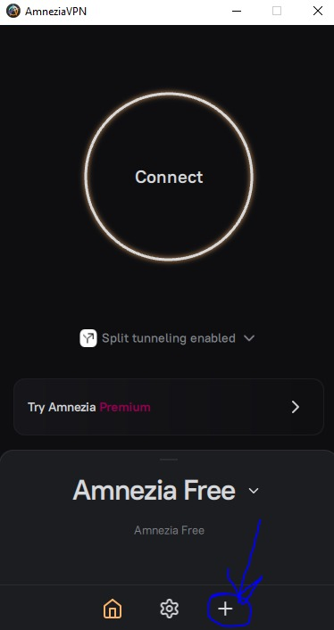
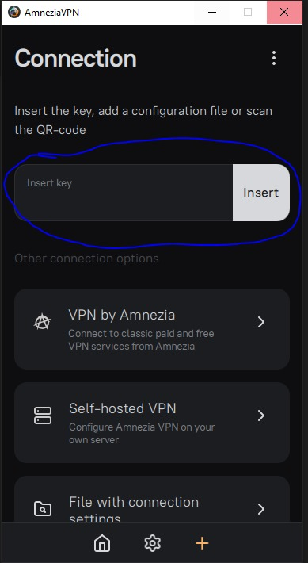
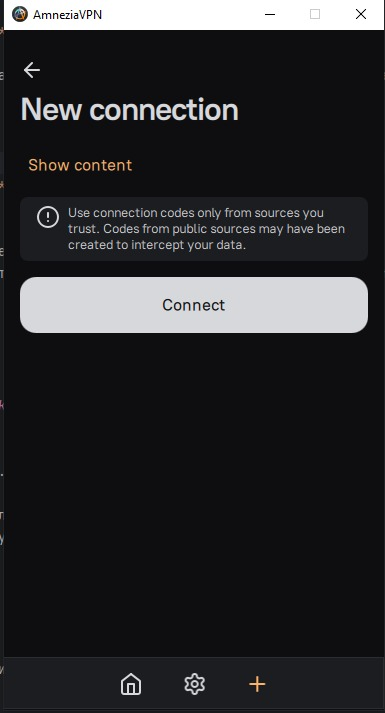
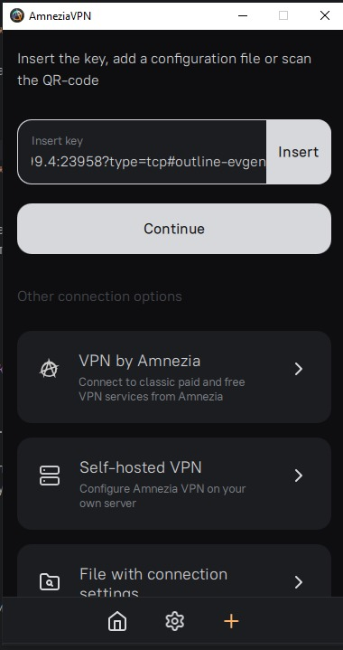
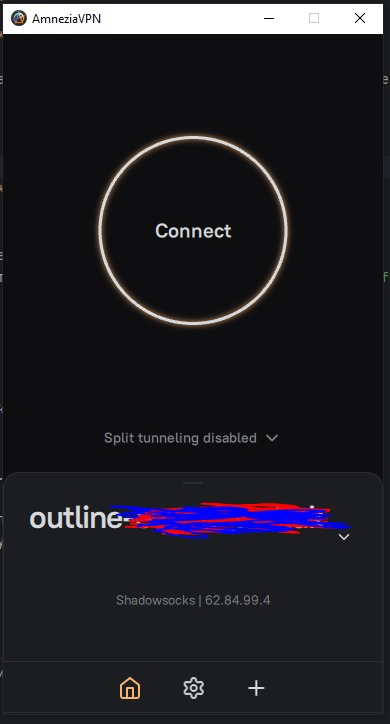
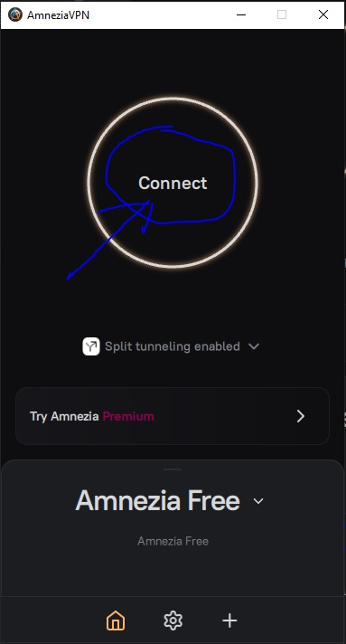

### **1. Установка AmneziaVPN**

Если у вас уже установлен AmneziaVPN, этот шаг можно пропустить. Если нет, скачайте и установите [приложение с официального сайта](https://amnezia.org/ru/downloads).

### **2. Получение конфигурации**

Вы должны иметь готовые конфигурации для WireGuard, Shadowsocks и VLESS, выданные вашим провайдером (мной).

#### Подключение

1. **Открываем AmneziaVPN**
2. **Создаём новое подключение.** Нажимаем **"Добавить VPN"**

3. Создаём подключение:
- Копируем ссылку и вставляем в поле Insert Key

- Нажимаем Continue

- Нажимаем Connect

- Сервер добавился, если появилось специфичное название

4. **Сохраняем подключение**
5. **Запускаем VPN** нажатием на переключатель

### Раздельное туннелирование

#### 1. Включение раздельного туннелирования в AmneziaVPN

1. **Открываем AmneziaVPN**.
2. Переходим в **Настройки → Раздельное туннелирование** (Split Tunneling).
    - Выбираем **Режим работы**:**Перенаправлять весь трафик через VPN (по умолчанию)** (цифра 1).
    - **Обходить VPN для указанных сайтов и IP-адресов** (режим исключений) (цифра 2).
    - **Использовать VPN только для указанных сайтов и IP-адресов** (режим включений) (цифра 3).

---

#### 2. Настройка раздельного туннелирования по сайтам и IP

#### 🔹 Обход VPN для локальных сайтов (режим исключений)

Если нужно исключить локальные сайты, например `example.local`, добавляем их в список исключений:

1. Включаем **Режим исключений**.
2. Нажимаем **Добавить сайт** и вводим домены (например, `example.local`, `intranet.company.com`).
3. Нажимаем **Сохранить**.

Также можно добавить локальные IP-адреса (`192.168.1.0/24`, `10.0.0.0/8`), чтобы они не шли через VPN.

#### 🔹 Использование VPN только для определённых сайтов (режим включений)

Если VPN нужен только для заблокированных сайтов, например `youtube.com`, `google.com`:

1. Включаем **Режим включений**.
2. Добавляем сайты (`youtube.com`, `google.com`).
3. Сохраняем настройки.

Теперь весь другой трафик будет идти напрямую, а указанные сайты — через VPN.

---

#### 3. Раздельное туннелирование для приложений

#### 🔹 Исключение приложений из VPN

В AmneziaVPN можно выбрать, какие приложения **не должны использовать VPN**.

1. Открываем **Настройки → Раздельное туннелирование**
2. Выбираем **Режим исключений**
3. Нажимаем **Добавить приложение** и выбираем из списка
4. Сохраняем настройки

Теперь это приложение будет работать без VPN, а остальные — через VPN.

#### 🔹 Использование VPN только для отдельных приложений

Если нужно, чтобы VPN использовало только одно приложение (например, браузер):

1. Включаем **Режим включений**
2. Нажимаем **Добавить приложение** и выбираем нужное
3. Сохраняем настройки

Теперь VPN работает только для этого приложения.

---

#### 4. Проверка работы раздельного туннелирования

Чтобы убедиться, что настройки работают:

* Открываем [**WhatIsMyIP**](https://www.whatismyip.com/) и проверяем, меняется ли IP
* Заходим на сайт, который исключён из VPN, и проверяем, что IP остаётся локальным
* Запускаем приложение и проверяем, идёт ли оно через VPN
