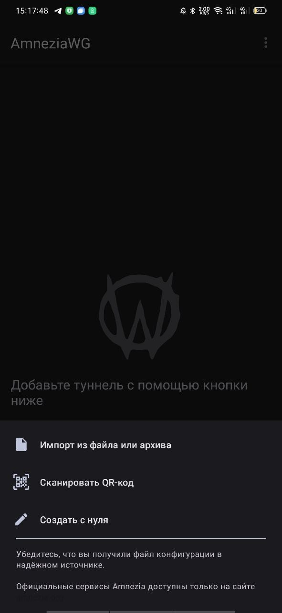
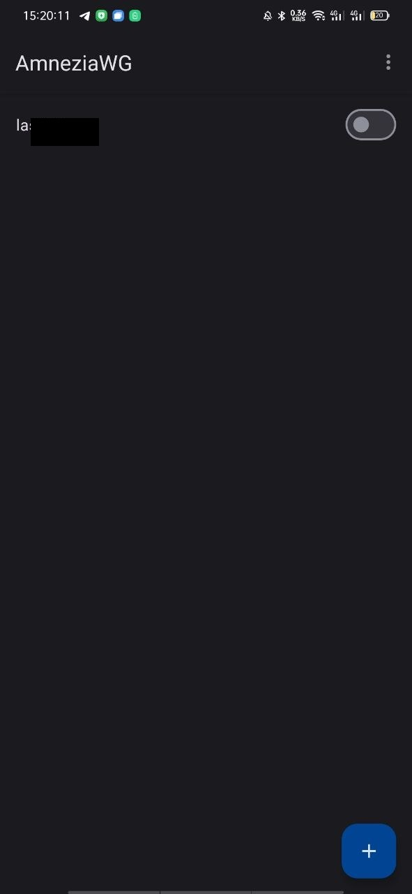
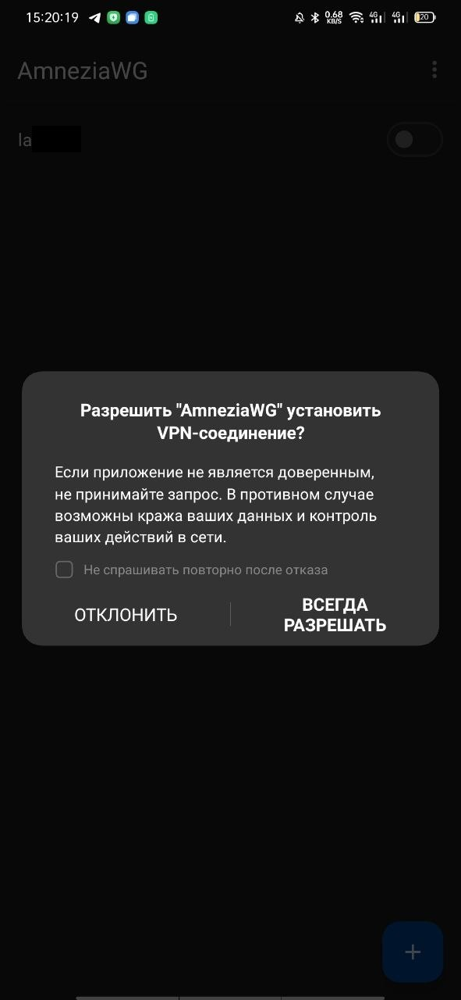
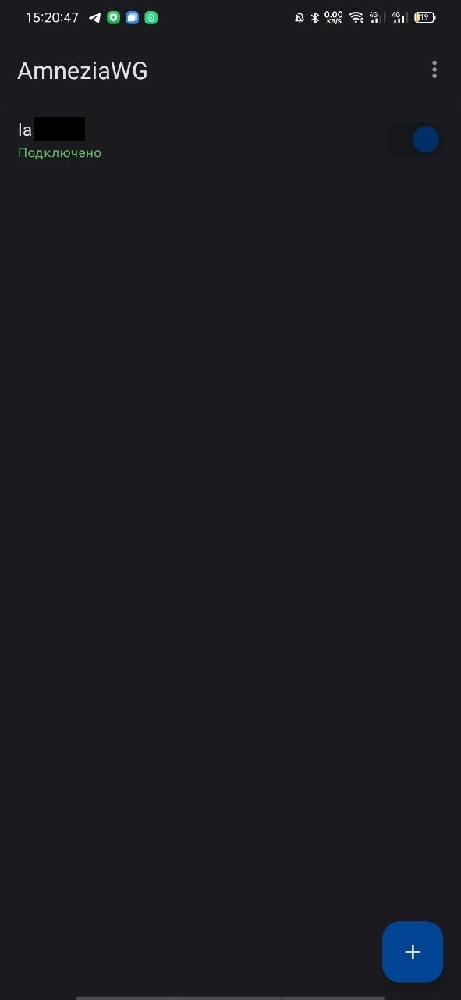
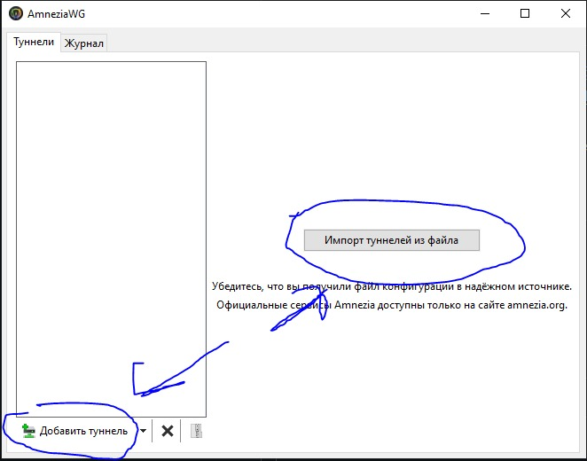
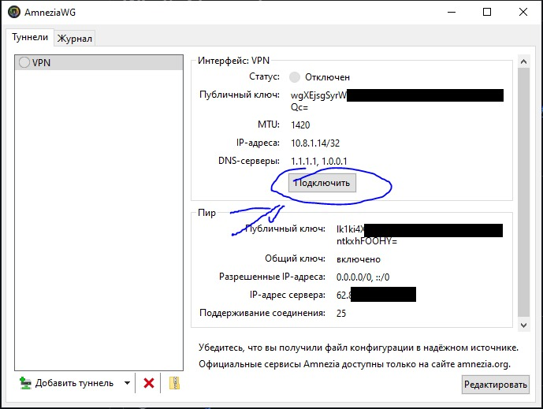
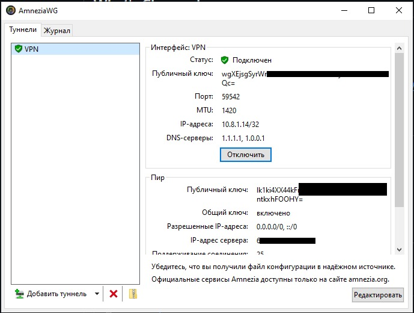

# Настройка AmneziaWG на Android и iOS

## Установка приложения

1. Откройте Google Play (Android) или App Store (iOS).
2. В строке поиска введите AmneziaWG
3. Установите приложение и откройте его
👉 Ссылка на AmneziaWG для Android
👉 Ссылка на AmneziaWG для iOS

## Добавление туннеля через QR-код

1. В главном окне приложения нажмите на "+" (плюс) в правом нижнем углу
2. Выберите "Сканировать QR-код"

3. Наведите камеру на предоставленный QR-код и отсканируйте его
4. В поле "Имя туннеля" введите любое название (только латиницей, без пробелов, например: "VPN_Tunnel")
5. Нажмите "Сохранить"

## Добавление туннеля через файл конфигурации

1. В главном окне AmneziaWG нажмите "+" (плюс) в правом нижнем углу
2. Выберите "Импорт из файла или архива"

3. Найдите файл конфигурации (он обычно заканчивается на .conf) и выберите его

## Подключение к VPN

1. В списке туннелей найдите созданное подключение
2. Нажмите переключатель (тумблер) рядом с названием туннеля

3. Если потребуется, выдайте разрешение

4. Если всё настроено правильно, статус изменится на "Подключено"

# Настройка AmneziaWG на Windows и macOS

## Установка приложения

**windows**: Я вам пришлю установочный файл.
**macOS**: AmneziaWG for macOS — в app store

Установите программу и запустите её.
📷 Окно AmneziaWG на Windows:

## Подключение через файл конфигурации 

1. В главном окне AmneziaWG нажмите "Добавить туннель" или "Импортировать из файла"

2. Выберите файл конфигурации (.conf)
3. Нажмите "Открыть"

## Подключение к VPN

1. Выберите добавленный туннель в списке
2. Нажмите "Подключить"

3. Если подключение успешно, статус изменится на "Подключено"

## Отключение VPN

Чтобы отключиться от VPN, просто нажмите "Отключить" в приложении AmneziaWG.

💡 Важно: Если вы хотите, чтобы VPN автоматически подключался при запуске системы, можно включить "Запускать при старте" в настройках AmneziaWG.

