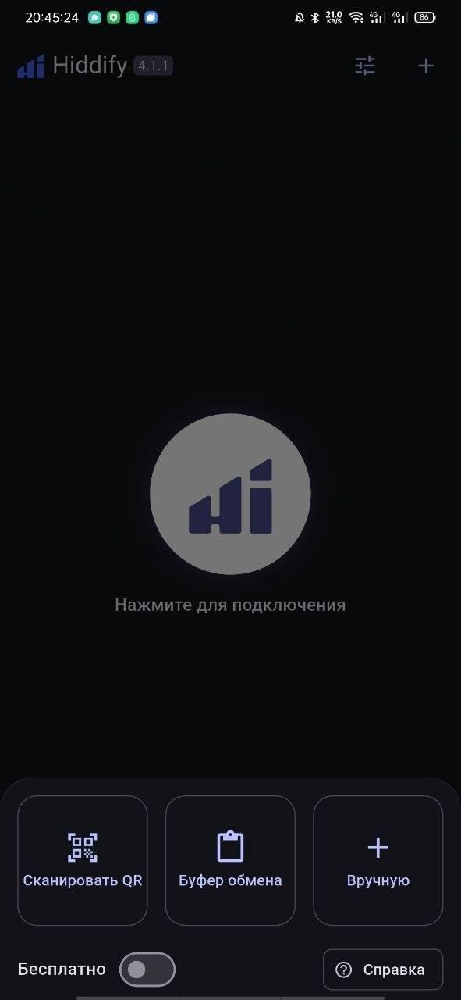
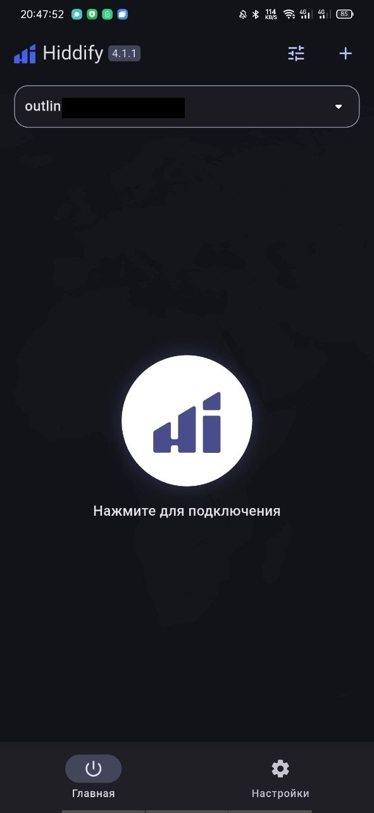
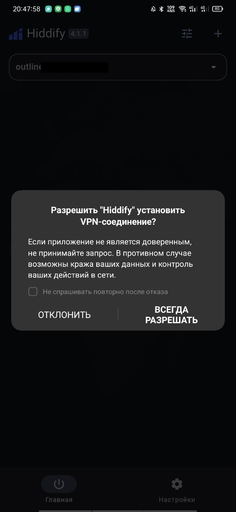
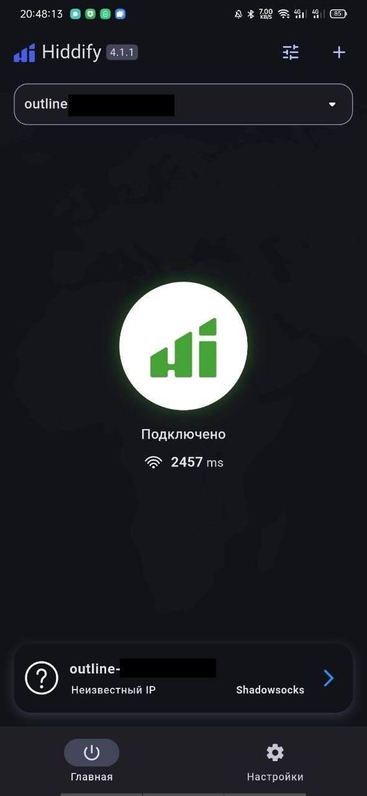
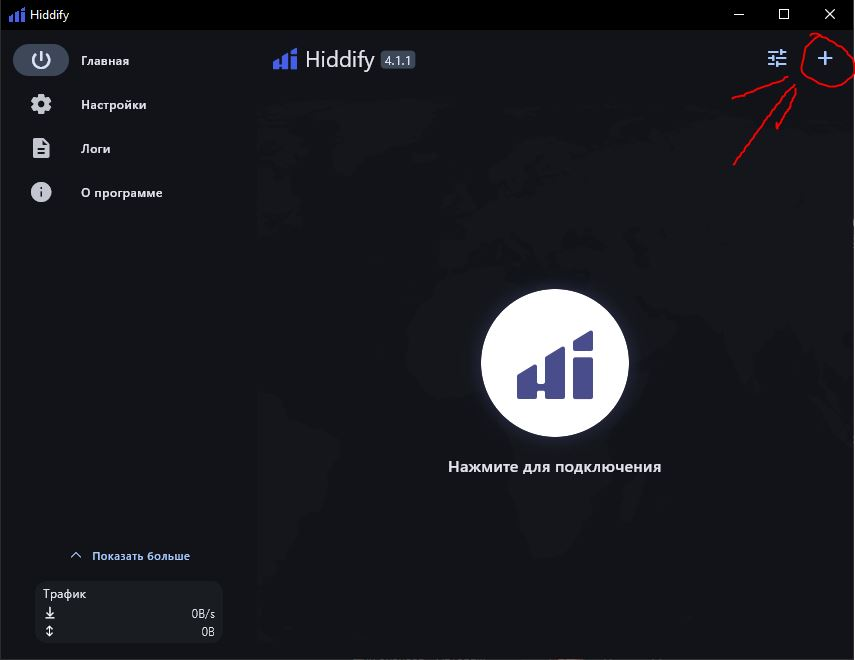
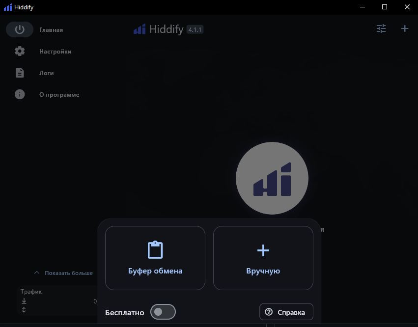
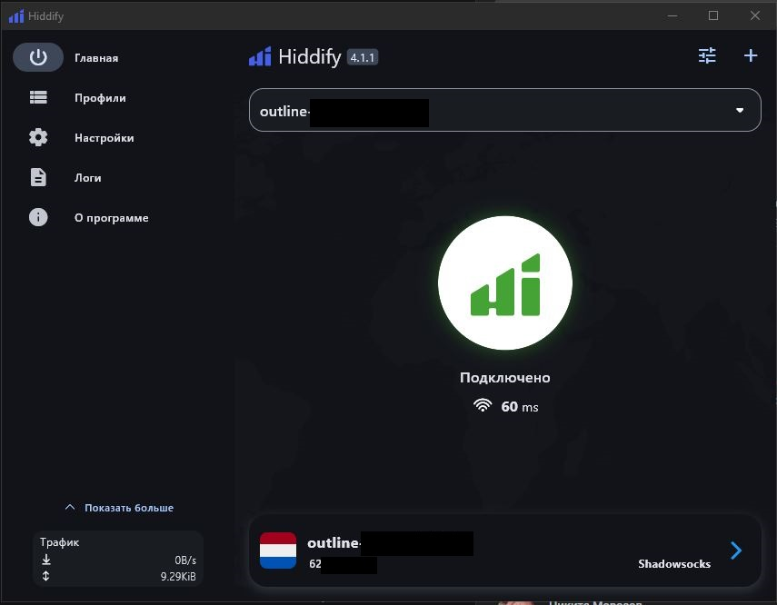

### 📱 Настройка Hiddify на Android и iOS

#### 1.Загрузка и установка

1. Перейдите в **Google Play Store или App store**
2. В строке поиска введите **"Hiddify Next"**. Также можно [скачать отсюда](https://github.com/hiddify/hiddify-app/releases)
3. Нажмите **"Установить"** и дождитесь завершения установки
4. Откройте установленное приложение **Hiddify Next**

---

#### 2. Добавление профиля подключения

1. Получите от вашего провайдера (меня) VPN **ссылку подписки** или **QR-код** для подключения
2. В главном окне приложения нажмите на кнопку **"+"** или **"Добавить профиль"**
3. Выберите способ добавления:

- **Сканировать QR:** если у вас есть QR-код, нажмите соответствующую кнопку и отсканируйте его
- **Буфер обмена:** если у вас есть ссылка, скопируйте её и выберете **Буфер обмена**
4. После успешного добавления профиля он появится в списке доступных подключений

---

#### 3. Подключение к VPN

1. В списке профилей выберите добавленный ранее профиль
2. Нажмите на кнопку "Нажмите для подключения"
3. Если потребуется, выдайте разрешение

3. При успешном подключении статус изменится на **"Подключено"**
4. 

---

### 💻 **Настройка Hiddify на Windows и macOS**

#### 1. Установка приложения

**Загрузка:**

Перейдите на официальный сайт Hiddify Next и скачайте версию приложения для вашей операционной системы (Windows или macOS). [Или лучше скачайте отсюда](https://github.com/hiddify/hiddify-app/releases)

**Установка:**

- Windows: Запустите скачанный установочный файл и следуйте инструкциям мастера установки
- macOS: Откройте скачанный файл и переместите приложение в папку **"Программы"**

**Запуск приложения:**

Откройте **Hiddify Next** из меню **"Пуск"** (Windows) или из папки **"Программы"** (macOS)

---

#### 2. Добавление профиля подключения

**Получение ссылки для подключения:**

Получите от вашего провайдера VPN **ссылку подписки** или **QR-код** для подключения

**Добавление профиля:**

1. В главном окне приложения нажмите на кнопку **"+"**

2. Выберите способ добавления: 

Скопируйте предоставленную ссылку и выберете **Буфер обмена**
**Сохранение профиля:**

После успешного добавления профиля он появится в списке доступных подключений

---

#### 3. Подключение к VPN

1. В списке профилей выберите добавленный ранее профиль
2. Нажмите на кнопку **"Подключить"** рядом с названием профиля
3. При успешном подключении статус изменится на **"Подключено"**

---

### **🔄 Отключение VPN**

* **Отключение:** Чтобы разорвать соединение, нажмите на кнопку **"Отключить"** рядом с активным профилем.
