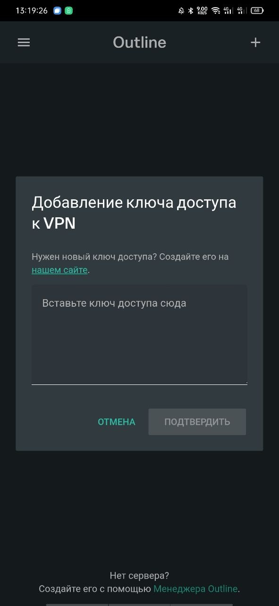
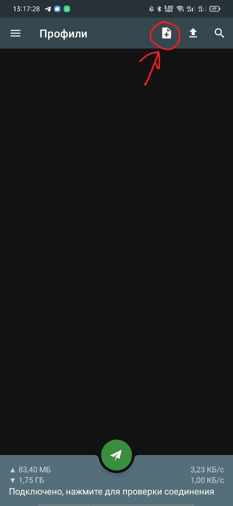
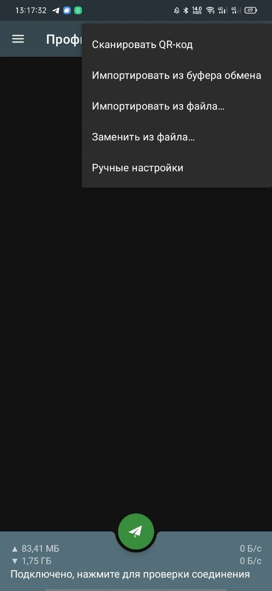

### Outline / ShadowSocks

#### Установка

* Для всех систем: установите [Outline](https://getoutline.org/).
* Для Android: дополнительно можно установить [ShadowSocks](https://github.com/shadowsocks/shadowsocks-android) вместо outline.

#### Настройка

* В Outline: вставьте ключ доступа, предоставленный вам.
  
* В ShadowSocks: отсканируйте QR-код или импортируйте ключ из буфера обмена.
  
  

#### Подключение

* Активируйте VPN через соответствующее приложение.
