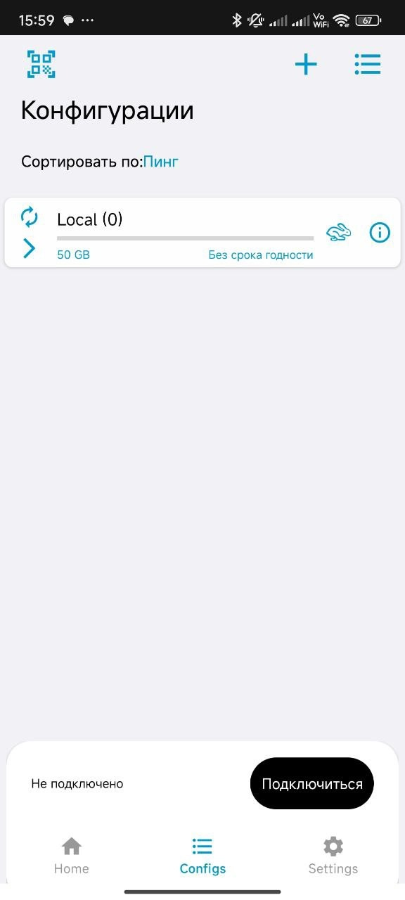
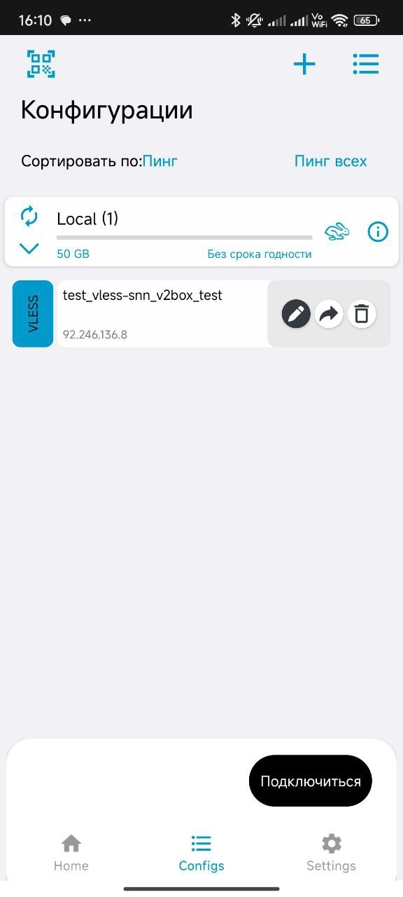
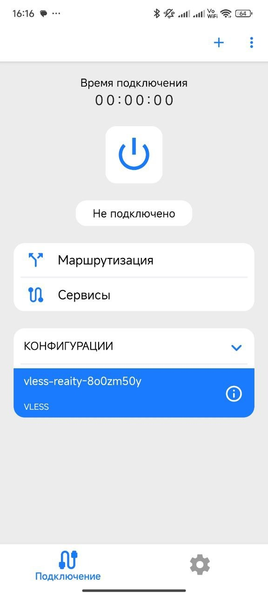
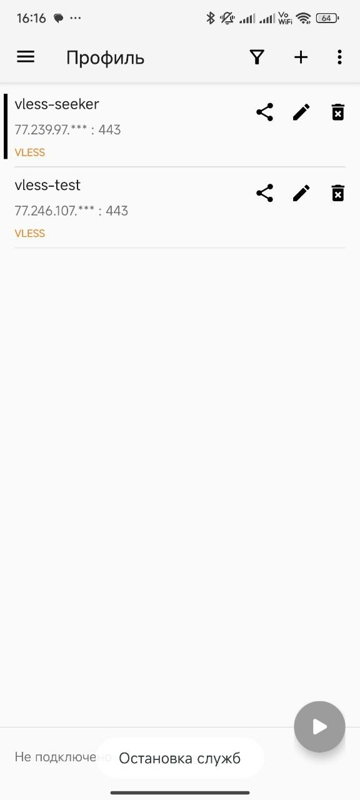

#### Установка

#### iOS, macos

Для iOS macos [скачать из аппстора](https://apps.apple.com/ru/app/v2box-v2ray-client/id6446814690)

#### Для Android

Установить из [play market](https://play.google.com/store/apps/details?id=dev.hexasoftware.v2box&hl=ru)

1. Нажмите **"Установить"** и дождитесь завершения установки.
2. **Запуск приложения:**
3. Откройте установленное приложение

#### Добавление профиля подключения

**Получение ссылки для подключения:**

Получите от вашего провайдера VPN **ссылку подписки** или **QR-код** для подключения.

**Добавление профиля:**

1. В главном окне приложения нажмите на кнопку configs, потом **"+".** Для импорта ключа в виде строки выберите пункт импортировать v2ray из буфера обмена. Для импорта конфигурации через QR-код, нажмите на кнопку в левом углу.

1. Выберите способ добавления:
2. **Сканировать QR-код:** если у вас есть QR-код, нажмите соответствующую кнопку и отсканируйте его
3. **Импорт из буфера обмена (выбрать uri вариант):** если у вас есть ссылка, скопируйте её, и приложение автоматически предложит импортировать профиль

**Сохранение профиля:**

После успешного добавления профиля он появится в списке доступных подключений.

#### 3. Подключение к VPN

1. **Выбор профиля:**

В списке профилей выберите добавленный ранее профиль.

1. **Установка соединения:**
2. Нажмите на кнопку подключить, чтобы установить соединение
3. При успешном подключении статус изменится на **"Подключено"**

### V2rayNG / v2rayTun

#### iOS, macos

для iOS macos [v2rayTun](https://apps.apple.com/ru/app/v2raytun/id6476628951)

#### Для Android

установить из play market: [v2rayNG](https://play.google.com/store/apps/details?id=com.v2ray.ang&hl=ru), [v2rayTun](https://play.google.com/store/apps/details?id=com.v2raytun.android&hl=ru)

1. Нажмите **"Установить"** и дождитесь завершения установки
2. **Запуск приложения:**
3. Откройте установленное приложение

#### Добавление профиля подключения

**Получение ссылки для подключения:**

Получите от вашего провайдера VPN **ссылку подписки** или **QR-код** для подключения

1. В главном окне приложения нажмите на кнопку **"+"** или **"Добавить профиль"**
2. Выберите способ добавления:**Сканировать QR-код:** если у вас есть QR-код, нажмите соответствующую кнопку и отсканируйте его
3. **Импорт из буфера обмена:** если у вас есть ссылка, скопируйте её, и приложение автоматически предложит импортировать профиль
4. **Сохранение профиля:**
5. После успешного добавления профиля он появится в списке доступных подключений

#### Подключение к VPN

1. **Выбор профиля:**
2. В списке профилей выберите добавленный ранее профиль
3. **Установка соединения:**
4. Нажмите на переключатель, чтобы установить соединение
5. При успешном подключении статус изменится на **"Подключено"**

v2raytun

v2rayng
