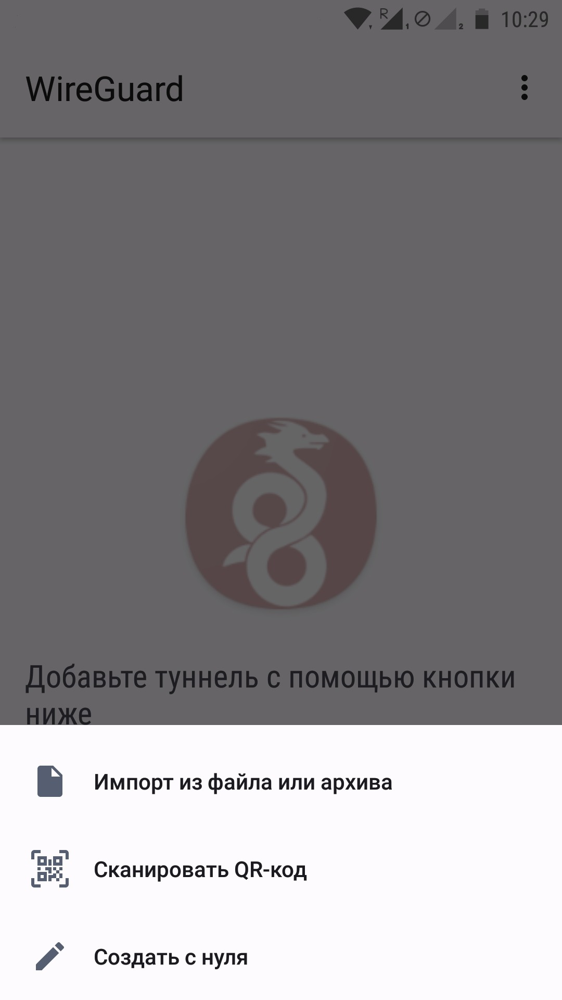
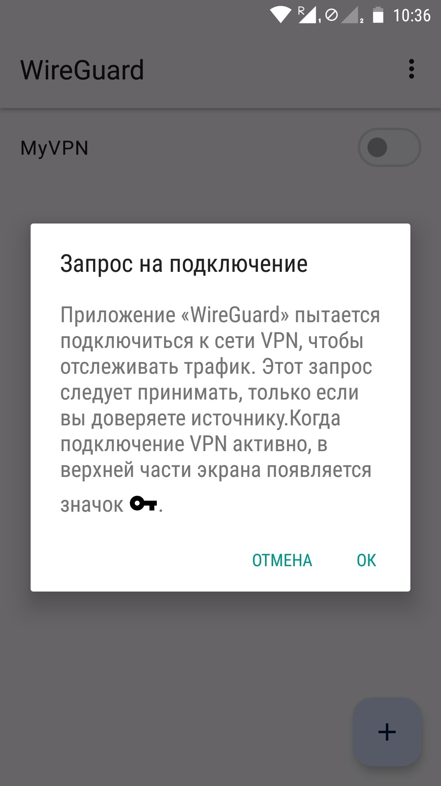

### 📱 Настройка WireGuard на Android и iOS

#### 1. Установка приложения

1. Откройте **Google Play (Android)** или **App Store (iOS)**.
2. В строке поиска введите **WireGuard или AmneziaWG**
3. Установите приложение и откройте его.

[👉 **Ссылка на WireGuard для Android**](https://www.wireguard.com/install/)

👉 [**Ссылка на WireGuard для iOS**](https://apps.apple.com/app/wireguard/id1441195209)

#### 2. Добавление туннеля через QR-код

1. В главном окне приложения нажмите на **"+" (плюс) в правом нижнем углу**.
2. Выберите **"Сканировать QR-код"**.
3. Наведите камеру на предоставленный **QR-код** и отсканируйте его.
4. В поле **"Имя туннеля"** введите любое название **(только латиницей, без пробелов, например: "VPN\_Tunnel")**.
5. Нажмите **"Сохранить"**.

#### 2. Добавление туннеля через файл конфигурации

1. В главном окне WireGuard нажмите **"+" (плюс) в правом нижнем углу**.
2. Выберите **"Импорт из файла или архива"**.
3. Найдите **файл конфигурации** (он обычно заканчивается на `.conf`) и выберите его.
4. В поле **"Имя туннеля"** введите название **(например, "MyVPN")**.
5. Нажмите **"Сохранить"**.

📷 **Пример добавления файла конфигурации:**

### **4. Подключение к VPN**

1. В списке туннелей найдите созданное подключение.
2. Нажмите **переключатель (тумблер) рядом с названием туннеля**.
3. Если всё настроено правильно, статус изменится на **"Подключено"**.

📷 **Подключение к VPN:**

### 💻 **Настройка WireGuard на Windows и macOS**

### **1. Установка приложения**

1. Перейдите на [официальный сайт WireGuard](https://www.wireguard.com/install/) и скачайте версию для вашей операционной системы: Windows: **WireGuard for Windows**
2. macOS: **WireGuard for macOS**
3. Установите программу и запустите её.

📷 **Окно WireGuard на Windows:**

### **3. Подключение через файл конфигурации**

1. В главном окне WireGuard нажмите **"Добавить туннель" → "Импортировать из файла"**.
2. Выберите **файл конфигурации** (`.conf`).
3. В поле **"Имя туннеля"** укажите название **(например, "WorkVPN")**.
4. Нажмите **"Сохранить"**.

📷 **Пример импорта файла:**

### **4. Подключение к VPN**

1. Выберите **добавленный туннель** в списке.
2. Нажмите **"Активировать"**.
3. Если подключение успешно, статус изменится на **"Подключено"**.

📷 **Пример подключения:**

### **🔄 Отключение VPN**

Чтобы отключиться от VPN, просто нажмите **"Отключить"** в приложении WireGuard.

💡 **Важно:** Если вы хотите, чтобы VPN автоматически подключался при запуске системы, можно включить **"Запускать при старте"** в настройках WireGuard.

### AmneziaWG

Можно [скачать отсюда](https://docs.amnezia.org/documentation/amnezia-wg/). Настройка такая же как для wireguard
